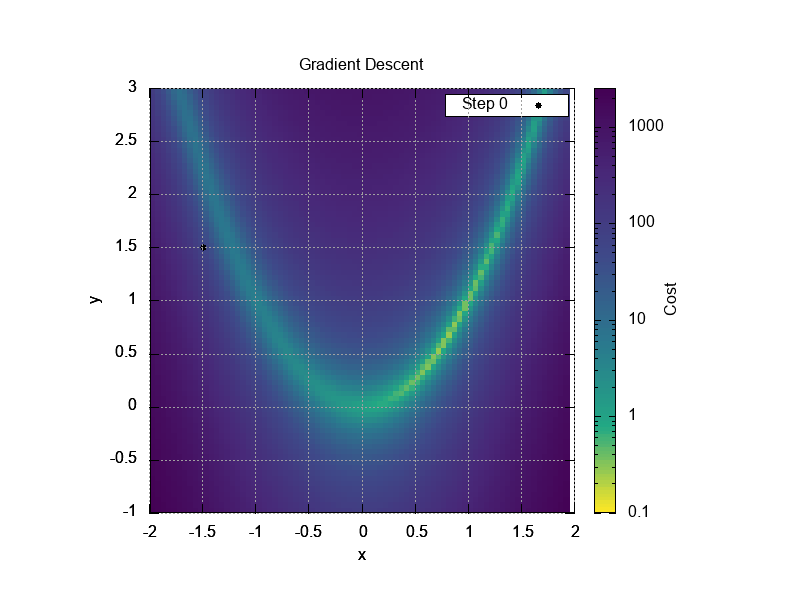

# 最適化アルゴリズムプロジェクト

このプロジェクトは、勾配法を可視化するためのもので、さまざまな最適化アルゴリズムを実装し、Rosenbrock関数を最適化します。以下のアルゴリズムが含まれています。

## 実装されている最適化アルゴリズム

1. **通常の勾配法 (NormalOptimizer)**
2. **モーメンタム法 (MomentumOptimizer)**
3. **ネステロフの勾配加速法 (NesterovOptimizer)**
4. **AdaGrad (AdaGradOptimizer)**
5. **RMSprop (RMSpropOptimizer)**
6. **AdaDelta (AdaDeltaOptimizer)**
7. **Adam (AdamOptimizer)**
8. **メトロポリス法 (MetropolisOptimizer)**
9. **ニュートン・ラフソン法 (NewtonRaphsonOptimizer)**

## rosenbrock関数での各勾配法の挙動の可視化

以下に、各最適化アルゴリズムの設定値と可視化結果を示します。

### 1. 通常の勾配法 (NormalOptimizer)
- **学習率 (Learning Rate):** 0.001
- **可視化:**
  

### 2. モーメンタム法 (MomentumOptimizer)
- **学習率 (Learning Rate):** 0.001
- **モーメンタム係数 (Momentum Coefficient):** 0.9
- **可視化:**
  

### 3. ネステロフの勾配加速法 (NesterovOptimizer)
- **学習率 (Learning Rate):** 0.001
- **モーメンタム係数 (Momentum Coefficient):** 0.9
- **可視化:**
  

### 4. AdaGrad (AdaGradOptimizer)
- **学習率 (Learning Rate):** 0.9
- **可視化:**
  

### 5. RMSprop (RMSpropOptimizer)
- **学習率 (Learning Rate):** 0.001
- **減衰率 (Decay Rate):** 0.9
- **可視化:**
  

### 6. AdaDelta (AdaDeltaOptimizer)
- **減衰率 (Decay Rate):** 0.9
- **可視化:**
  

### 7. Adam (AdamOptimizer)
- **学習率 (Learning Rate):** 0.001
- **β1:** 0.9
- **β2:** 0.999
- **可視化:**
  

### 8. メトロポリス法 (MetropolisOptimizer)
- **温度 (Temperature):** 20
- **冷却率 (Cooling Rate):** 0.99
- **可視化:**
  

### 9. ニュートン・ラフソン法 (NewtonRaphsonOptimizer)
- **最大ステップ数 (Max Steps):** 10000
- **可視化:**
  

## プロジェクト構成

- `optimizer.h`: 最適化アルゴリズムのクラスと関数の宣言
- `optimizer.cpp`: 最適化アルゴリズムの実装
- `gradient_descent.cpp`: 勾配降下法の実行と結果の保存

## 使用方法

1. プロジェクトをクローンまたはダウンロードします。
2. `make`コマンドを使用してプログラムをコンパイルします。
3. 実行時に、使用する最適化手法を選択します。
4. 結果は`gradient_descent.dat`に保存され、ヒートマップデータは`heatmap.dat`に保存されます。

## 依存関係

- C++11以上のコンパイラ
- 標準ライブラリ

## 注意事項

- 各最適化アルゴリズムのパラメータは、必要に応じて調整できます。
- プロジェクトは教育目的であり、商用利用は推奨されません。